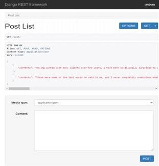
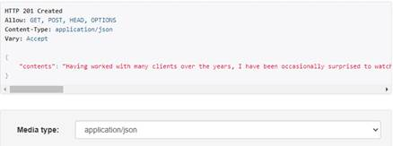
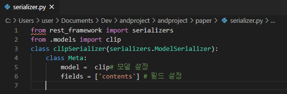
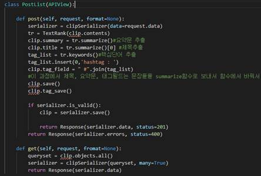
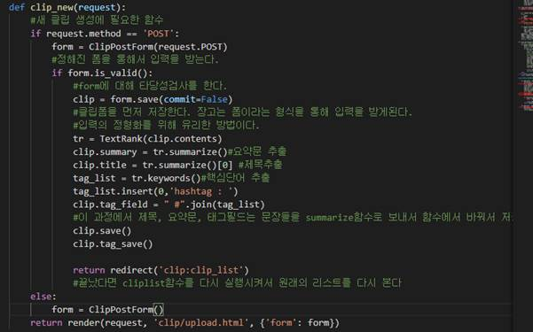
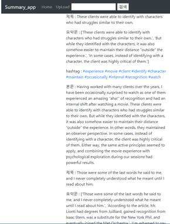
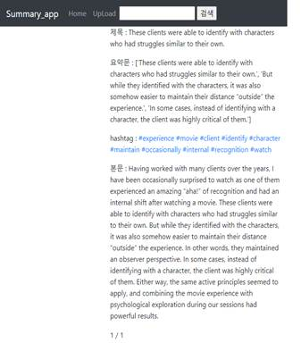
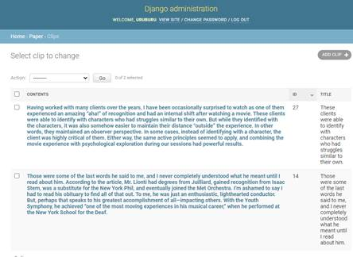
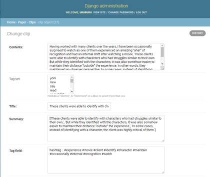

### B. TextRank 

TextRank란 구글의 PageRank로 부터 발전한 알고리즘이다. PageRank는 웹페이지가 다른 웹페이지로부터 얼마나 많이 참조되는지에 대한
중요도를 그래프화 시키고, 이를 PageRank 계산식을 통해 웹페이지의 순위를 나타내는 알고리즘으로, 순위가 높을 수록 다른 페이지로부터 
이 페이지를 참조하는 경우가 많으며 웹페이지들 중 중요도가 높다는 것을 의미한다.
이를 문서에 응용하여 각 문장과 단어들이 페이지에서 얼마나 자주 등장하는지에 대하여 각각 가중치를 부여해 그래프화 시키고, 이를 다시 PageRank 알고리즘을 이용하여 상호간의 연관도에 따라 중요도를 계산해 문장과 단어를 추출한다.
TextRank에서 PageRank 모델을 적용하기 위한 그래프화에는 다양한 방식이 있는데 이중 우리는 TF-IDF모델을 이용하였다.
TF-IDF모델은 어떤 문서군에서 특정단어가 문서 내에서 얼만큼의 빈도를 등장하는지에 대한 단어 빈도 TF(Term Frequency)와 전체 문서의 개수를 해당 단어가 포함된
문서의 개수로 나눈 역문헌 빈도 IDF(Inverse Document Freqeuncy)를 혼합한 통계적 수치로 수식으로는
W(i,j) = tf(i,j)*log(N/df(i,j))
로 나타낼 수있으며, 이는 머신러닝 패키지인 Scikit-learn을 사용하여 계산할 수 있다.


#### ㄱ. 사용 모듈들

```python
from sklearn.feature_extraction.text import TfidfVectorizer #TF-IDF 모델 생성을 위한 머신러닝 패키지
from sklearn.feature_extraction.text import CountVectorizer
from sklearn.preprocessing import normalize
import numpy as np
import nltk
from nltk.corpus import stopwords
from nltk.stem import WordNetLemmatizer
from nltk.stem import PorterStemmer
```

nltk : 영어의 자연어처리를 위한 모듈
numpy : 그래프의 array 연산을 위한 모듈
Scikit-learn : 그래프 생성을 위한 머신러닝 모듈  

#### ㄴ. SentenceTokenizer 

```python
    def splitsenteces(self, text):  #원문을 문장 단위로 분리
        tokens = [word for word in nltk.sent_tokenize(text)]
        return tokens

    def preprocessing(self, sentences):     #문장을 전처리하여 일반화시킴
        proc_words = []
        for sentence in sentences:
            #단어화
            tokens = [word for word in nltk.word_tokenize(sentence)]
            # 전체 소문자화
            tokens = [word.lower() for word in tokens]
            #불용어 처리
            stop = stopwords.words('english')
            stop.append('the')
            tokens = [token for token in tokens if token not in stop]
            #3자 이하의 단어 삭제
            tokens = [word for word in tokens if len(word) >= 3]

            #표제어 추출
            lmtzr = WordNetLemmatizer()
            tokens = [lmtzr.lemmatize(word) for word in tokens]
            #동사 표제화
            tokens = [lmtzr.lemmatize(word, 'v') for word in tokens]

            sent = ' '.join(tokens)
            proc_words.append(sent)

        return proc_words
```

TextRank에서 본문 innput text를 문자열 형태로 입력받으면, 우선 splitsenteces 함수에서 본문을 문장단위로 나누어 return 한다.
다음으로 나누어진 문장들을 preprocessing 함수로 가져와 각 문장을 단어단위로 쪼갠 list로 만든 후, 1. 소문자화, 2. 불용어 처리, 3. 3자 이하의 단어 삭제, 4. 표제화(단어의 기본형으로 변환)의 전처리를 한 뒤 다시 하나의 문자열로 합쳐 그래프 연산을 위한 준비를 한다. 이를 모든 문장에대하여 반복하여 전처리를 한 문장들의 list를 return 한다.

 

#### ㄷ. GraphMatrix

```python
class GraphMatrix(object):          #TF-IDF 모델 그래프 생성 클래스
    def __init__(self):
        self.tfidf = TfidfVectorizer()
        self.cnt_vec = CountVectorizer()
        self.graph_sentence = []

    def build_sent_graph(self, sentence):   #각 문장간의 correlation matrix를 이용한 가중치 그래프 생성
        tfidf_mat = self.tfidf.fit_transform(sentence).toarray()
        self.graph_sentence = np.dot(tfidf_mat, tfidf_mat.T)

        return self.graph_sentence

    def build_words_graph(self, sentence):  #각 단어간의 correlation matrix를 이용한 가중치 그래프 생성
        cnt_vec_mat = normalize(self.cnt_vec.fit_transform(sentence).toarray().astype(float), axis=0)
        vocab = self.cnt_vec.vocabulary_

        return np.dot(cnt_vec_mat.T, cnt_vec_mat), {vocab[word]: word for word in vocab}
```

TF-IDF 모델을 기반으로 문서에서 어떤 문장 혹은 단어에 대하여 얼마나 자주 나타나는가에 따라 가중치를 부여하고 이를 그래프화 시키는 클래스이다. 
build_sent_graph 함수에서는 전처리된 문장을 입력받아 TF-IDF Matrix를 만든 후 Sentence graph를 return 한다.
그리고 build_word_graph 함수에서는 단어들에 대한 countvectorized matrix를 생성하여 word graph와 index : word 형식의 dictionary를 return 한다.


#### ㄹ. Rank

```python
                             #문장과 단어의 순위 계산 클래스
class Rank(object):                     #TR(V(i)) = (1-d) + d*sum(in(V(i)))(w(j,i)*TR(V(j))/sum(out(V(j)))(w(j,k)))
    def get_ranks(self, graph, d=0.85):  # d = damping factor (구글 pagerank에서도 0.85를 사용)
        A = graph
        matrix_size = A.shape[0]

        for id in range(matrix_size):
            A[id, id] = 0  # 그래프의 (n,n) 부분을 0으로
            link_sum = np.sum(A[:, id])  # A[:, id] = A[:][id]

            if link_sum != 0:
                A[:, id] /= link_sum
            A[:, id] *= -d
            A[id, id] = 1

        B = (1 - d) * np.ones((matrix_size, 1))
        ranks = np.linalg.solve(A, B)  # 연립방정식 Ax = b

        return {idx: r[0] for idx, r in enumerate(ranks)}   #idx : rank 형태의 dictionary 반환


```

PageRank와 같은 원리를 응용한 TextRank로 앞서 생성한 그래프를 이용하여 주석의 식 
TR(Vi)=(1−d)+d∗∑Vj∈In(Vi)wji∑Vk∈Out(Vj)wjkTR(Vj)
에 따라 문서에서의 각각의 문장과 단어의 순위(Ranking)을 부여한다.


#### ㅁ. TextRank

```python
class TextRank(object):         #위의 클래스들을 전체적으로 구동하는 TextRank 클래스 생성
    def __init__(self, text, method='s', line_split=True): 
        self.sent_tokenize = SentenceTokenizer()
        self.sentences = self.sent_tokenize.splitsenteces(text)     #입력받은 본문을 문장단위로 분리한다
        self.words = self.sent_tokenize.preprocessing(self.sentences)       #원문에서 분리한 문장들을 전처리한다
        self.graph_matrix = GraphMatrix()
        self.sent_graph = self.graph_matrix.build_sent_graph(self.words)    #전처리한 문장들로부터 sentence 그래프를 생성한다
        self.words_graph, self.idx2word = self.graph_matrix.build_words_graph(self.words)   #전처리한 문장들로부터 word 그래프와 word dictionary를 생성한다
        self.rank = Rank()
        self.sent_rank_idx = self.rank.get_ranks(self.sent_graph)       #sentence 그래프를 이용해 문장의 textrank 가중치를 적용한다
        self.sorted_sent_rank_idx = sorted(self.sent_rank_idx, key=lambda k: self.sent_rank_idx[k], reverse=True) #가중치에 따라 중요문장의 index를 정렬한다
        self.word_rank_idx = self.rank.get_ranks(self.words_graph)      #word 그래프를 이용해 단어의 textrank 가중치를 적용한다
        self.sorted_word_rank_idx = sorted(self.word_rank_idx, key=lambda k: self.word_rank_idx[k], reverse=True)   #가중치에 따라 중요 단어의 index를 정렬한다

    def debug(self):
        return self.sent_rank_idx, self.word_rank_idx, self.sent_graph, self.words_graph, self.sentences

    def summarize(self, sent_num=3):        #정렬된 문장들로부터 3개를 기본으로 선택하는 함수
        summary = []
        index = []

        for idx in self.sorted_sent_rank_idx[:sent_num]:
            index.append(idx)

        index.sort()
        for idx in index:                   #최고 우선순위 3개의 index로부터 문장을 찾아 summery에 넣는다
            summary.append(self.sentences[idx])
        return summary

    def keywords(self, word_num=10):        #정렬된 단어들로부터 10개를 기본으로 선택하는 함수
        rank = Rank()
        rank_idx = rank.get_ranks(self.words_graph)
        sorted_rank_idx = sorted(rank_idx, key=lambda k: rank_idx[k], reverse=True)

        keywords = []
        index = []

        for idx in sorted_rank_idx[:word_num]:
            index.append(idx)

        # index.sort()
        for idx in index:
            keywords.append(self.idx2word[idx])

        return keywords

```

ㄱ. 부터 -ㄹ. 까지의 클래스들을 이용하여 본문을 입력 받으면 내부에서 문장 분리, 전처리, 그래프화, textrank적용을 순서대로 처리한 후 이를 정렬하고 summerize함수를 호출하면 가중치가 가장 높은 3개의 문장을, keywords 함수를 호출하면 가중치가 높은 10개의 단어를 list 형태로 return한다.

원문

```
In the distant past, a powerful race called the Forerunners 
fought an alien parasite known as the Flood. 
The Flood, which spread through infestation of sentient life, overran much of the Milky Way Galaxy. 
Exhausting all other strategies, the Forerunners conceived the Halo Array—ring-shaped 
megastructures and weapons of last resort that would destroy all sentient life in the galaxy
 to stop the Flood. Delaying as long as they could, the Forerunners activated the rings and disappeared.[15]

Nearly a hundred thousand years later in the 26th century, humanity—under the auspices 
of the United Nations Space Command, or UNSC—colonize many worlds thanks to the 
development of faster-than-light "slipspace" travel. Tensions between the government 
and colonies desiring independence sparks violent clashes. The UNSC sponsors the 
SPARTAN-II Project to create an elite group of enhanced supersoldiers, whose purpose 
is to suppress the rebellions covertly.[16] In the year 2525, human worlds come under
 attack by a theocratic alliance of alien races known as the Covenant. The Covenant 
leadership declares humanity heretics and an affront to their gods— the Forerunners—
and begin a genocidal holy war. The Covenant's superior technology and numbers prove 
decisive advantages; though effective, the Spartans are too few in number to turn the tide 
of battle in humanity's favor. After the Covenant invade Reach, the UNSC's last major stronghold 
besides Earth, Master Chief John 117 is one of the few remaining Spartans left.

The rediscovery of the Halo rings sets the humans against the Covenant, who believe they 
are instruments of transcendence, not destruction. Master Chief and his artificial intelligence
 Cortana are instrumental in the destruction of a Halo ring to stop the Covenant and the threat 
of the Flood. The Covenant descends into civil war following the expulsion of the Sangheili species,
 with many grappling over the revelation that their religion is false. The disgraced former Covenant
 Sangheili commander known as the Arbiter, along with the rest of his race, help the humans destroy 
the Covenant and stop its leader from activating the Halo Array.[17] The Human-Covenant War ends, 
though conflict continues to rage throughout the universe. The UNSC creates a new generation of Spartans,
 and tensions between the UNSC and colonists resume.
```

TextRank를 실행한 후

```
1. Exhausting all other strategies, the Forerunners conceived the Halo Array—ring-shaped megastructures and weapons of last resort that would destroy all sentient life in the galaxy to stop the Flood.
2. Master Chief and his artificial intelligence Cortana are instrumental in the destruction of a Halo ring to stop the Covenant and the threat of the Flood.
3. The disgraced former Covenant Sangheili commander known as the Arbiter, along with the rest of his race, help the humans destroy the Covenant and stop its leader from activating the Halo Array.
```

```
keywords : ['covenant', 'spartan', 'halo', 'humanity', 'unsc', 'flood', 'stop', 'human', 'ring', 'array']
```

### C. SERVER

#### ㄱ. 사용한 프레임워크와 모듈, 지원 프로그램
##### 서버구성에 사용
```
서버 프레임워크  : Django 3.0.5
API call 구성 : Django Rest Framework 1.2.9
```
##### 배포작업에 이용
```
uWSGI 2.0
Nginx 1.14
AWS EC2 
```
#### ㄴ. 중간보고서에서의 변경점
##### ㄴ-1 API call 구현

ㄴ-1-1 Django의 Rest framework를 이용하여 get 과 post 콜을 구현했다.

      

해당 화면은 장고 프레임워크 내부에서 맥의 POSTMAN처럼 만든 GET과 POST콜을 테스트해볼 수 있는 화면이다. 정상적으로 json 통신이 되는 것을 확인할 수 있다.

 

이와 같이 포스트콜을 보내서 201 응답을 받음을 확인할 수 있다.



ㄴ-1-2 공통된 직렬화 형식

Json 형식으로 

```
{
        "contents": "Having worked with many clients over the years, I have been occasionally surprised to watch as one of them experienced an amazing “aha!” of recognition and had an internal shift after watching a movie. These clients were able to identify with characters who had struggles similar to their own. But while they identified with the characters, it was also somehow easier to maintain their distance “outside” the experience. In other words, they maintained an observer perspective. In some cases, instead of identifying with a character, the client was highly critical of them. Either way, the same active principles seemed to apply, and combining the movie experience with psychological exploration during our sessions had powerful results."
    }
```

와 같이 {“컨텐츠” : “내용”} 의 json 형식을 취해서 API콜을 구현했다.

이를 위한 모듈 serializer를 구현했다.


 이와 함께 사용하는 함수 또한 구현했다.



전체 소스코드는 기존 함수 뷰와 크게 다르지 않다. 이에 대한 비교는 아래에 웹콜을 함께 만들어두었다. Getcall 보다는 Postcall에 집중해서 구현했다.

##### ㄴ-2 TextRank 알고리즘과의 연동



기존함수에서 텍스트랭크를 이용해 요약문, 제목, 핵심단어를 추출해 정해진 양식에 삽입하는 함수로 바꾸었다.

AWS위에 올리는 배포작업을 거쳐야 어플리케이션과 API통신을 구현할 수 있기에 배포작업을 진행했다. 전체적인 구조는 다음과 같다.

사용자 <-> Nginx 웹서버 <-> uWSGI <-> Django

**ㄷ**-0 AWS

. 이 모든 과정을 소화하는 클라우드 서비스인 AWS에 업로드 작업을 진행했으며, EC2 프리티어 우분투 16.04를 이용해서 구성했다. 인바운드 8080포트를 여는 보안규칙을 구성했으며 기본적인 우분투 기반위에서 SSH콜과 SCP 콜을 이용하여 서버를 조작한다.

ㄷ-1 uWSGI

**uwsgi \** 

**--http :8080 \**

**--home /home/ubuntu/pyenv/versions/summary \**

**--chdir /srv/project/andproject \**

**-w config.wsgi**

위와 같은 구성을 이용해서 wsgi를 구동시킴

**ㄷ**-2 Nginx

```
server {
    listen 8080; //8080번 포트를 사용하겠다는 뜻이다
    server_name *.compute.amazonaws.com; //아래와 같은 주소로 접속하는걸 받겠다는 뜻이다.
    charset utf-8;
    client_max_body_size 128M;
 
    location / {
        uwsgi_pass  unix:///tmp/andproject.sock;
        include     uwsgi_params;
    }
}
```

Nginx는 다음과 같이 설정하여 SCP 통신으로 AWS에 업로드 한다.

**ㄷ**-3 nginx와 **uWSGI의 **연동

nginx <-> wsgi 통신은 기본적으로 socket 방식을 사용한다. HTTP 방식을 사용할 수 있지만 통신에서 로스가 많이 발생하는 단점이 있다. 그에 비해서 wsgi app은 서버 안쪽에서 서버의 요청을 django 어플리케이션에 중계하는 역할을 하기 때문에 무거운 HTTP 요청을 보다는 socket이라는 전송방식을 사용한다.` `

```
[Unit]
Description=uWSGI service
After=syslog.target
 
[Service]
ExecStart=/home/ubuntu/.pyenv/versions/uwsgi-env/bin/uwsgi -i /srv/ec2_deploy_project/.config/uwsgi/mysite.ini
 
Restart=always
KillSignal=SIGQUIT
Type=notify
StandardError=syslog
NotifyAccess=all
 
[Install]
WantedBy=multi-user.target
```

명세는 다음과 같이 작성하였다. 이를 데몬에 넣어 서버컴퓨터 부팅될 때, 자동으로 백그라운드에서 동작하게 만들어준다. 

**ㄹ**. **결과화면**

**ㄹ**-1 **사용자** **화면**

가장 **중요한** **문장을** **제목으로** **사용**

 

가장 중요한 세 문장을 요약문으로 구현

해쉬태그 구현(가장 중요도가 높은 10개 단어)

 

이후 입력받은 본문 출력

 

 

 



 

ß 해쉬태그를 이용한 검색기능 활용시 Experience를 검색하면 나오는 화면이다. 

 

 

 

 

 

**ㄹ**-2 **관리자** **화면**

 



이와 같이 클립리스트를 관리자 화면에서 관리하는 작업이 가능



내부 내용을 수정하는 작업도 가능하다

```
uwsgi \ 
--http :8080 \
--home /home/ubuntu/.pyenv/versions/summary \
--chdir /srv/project/andproject \
-w config.wsgi
```
